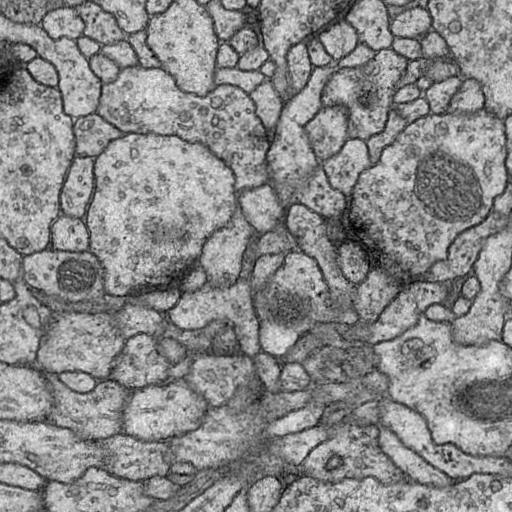
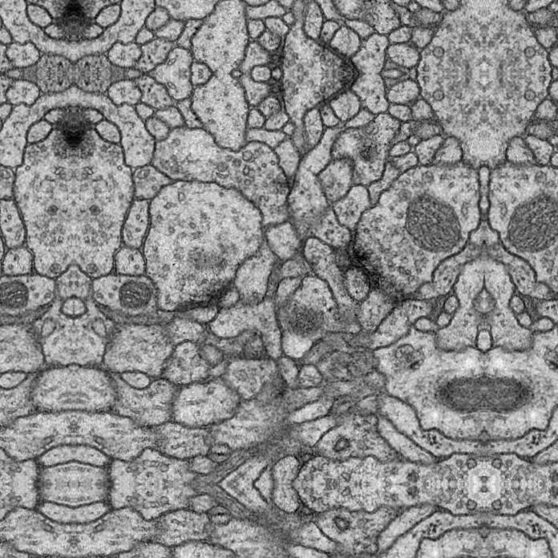
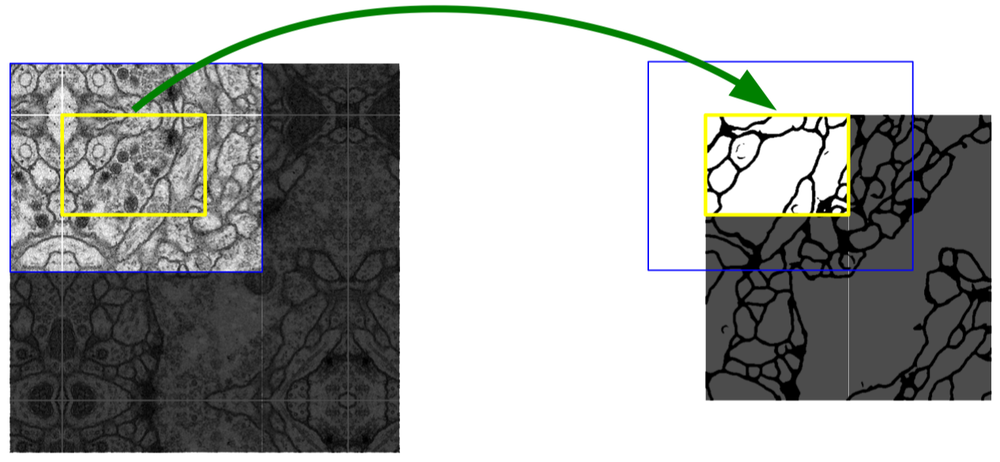

# U-Net with Keras

<p align="center">
<a href="https://arxiv.org/abs/1505.04597"></a>

</p>

Keras implementation of U-Net, with simple annotation

> U-Net: Convolutional Networks for Biomedical Image Segmentation
> Paper URL : https://arxiv.org/abs/1505.04597

## Dataset
1. [ISBI Challenge: Segmentation of neuronal structures in EM stacks](http://brainiac2.mit.edu/isbi_challenge/home)    
2. [Cell Tracking Challenge](http://celltrackingchallenge.net)  
 a. DIC-C2DH-HeLa (HeLa cells on a flat glass)  
 b. PhC-C2DH-U373 (Glioblastoma-astrocytoma U373 cells on a polyacrylamide substrate)
    
## Preprocessed

### Original *512x512*


### Overlap-tile strategy *696x696*


## Model

```
__________________________________________________________________________________________________
Layer (type)                    Output Shape         Param #     Connected to                     
==================================================================================================
input_1 (InputLayer)            (None, 572, 572, 1)  0                                            
__________________________________________________________________________________________________
conv1_1 (Conv2D)                (None, 570, 570, 64) 640         input_1[0][0]                    
__________________________________________________________________________________________________
conv1_2 (Conv2D)                (None, 568, 568, 64) 36928       conv1_1[0][0]                    
__________________________________________________________________________________________________
maxpooling_1 (MaxPooling2D)     (None, 284, 284, 64) 0           conv1_2[0][0]                    
__________________________________________________________________________________________________
conv2_1 (Conv2D)                (None, 282, 282, 128 73856       maxpooling_1[0][0]               
__________________________________________________________________________________________________
conv2_2 (Conv2D)                (None, 280, 280, 128 147584      conv2_1[0][0]                    
__________________________________________________________________________________________________
maxpooling_2 (MaxPooling2D)     (None, 140, 140, 128 0           conv2_2[0][0]                    
__________________________________________________________________________________________________
conv3_1 (Conv2D)                (None, 138, 138, 256 295168      maxpooling_2[0][0]               
__________________________________________________________________________________________________
conv3_2 (Conv2D)                (None, 136, 136, 256 590080      conv3_1[0][0]                    
__________________________________________________________________________________________________
maxpooling_3 (MaxPooling2D)     (None, 68, 68, 256)  0           conv3_2[0][0]                    
__________________________________________________________________________________________________
conv4_1 (Conv2D)                (None, 66, 66, 512)  1180160     maxpooling_3[0][0]               
__________________________________________________________________________________________________
conv4_2 (Conv2D)                (None, 64, 64, 512)  2359808     conv4_1[0][0]                    
__________________________________________________________________________________________________
maxpooling_4 (MaxPooling2D)     (None, 32, 32, 512)  0           conv4_2[0][0]                    
__________________________________________________________________________________________________
conv5_1 (Conv2D)                (None, 30, 30, 1024) 4719616     maxpooling_4[0][0]               
__________________________________________________________________________________________________
conv5_2 (Conv2D)                (None, 28, 28, 1024) 9438208     conv5_1[0][0]                    
__________________________________________________________________________________________________
upsampling1 (Conv2DTranspose)   (None, 56, 56, 512)  2097664     conv5_2[0][0]                    
__________________________________________________________________________________________________
cropped_conv4_2 (Cropping2D)    (None, 56, 56, 512)  0           conv4_2[0][0]                    
__________________________________________________________________________________________________
skip_connection1 (Concatenate)  (None, 56, 56, 1024) 0           upsampling1[0][0]                
                                                                 cropped_conv4_2[0][0]            
__________________________________________________________________________________________________
conv6_1 (Conv2D)                (None, 54, 54, 512)  4719104     skip_connection1[0][0]           
__________________________________________________________________________________________________
conv6_2 (Conv2D)                (None, 52, 52, 512)  2359808     conv6_1[0][0]                    
__________________________________________________________________________________________________
upsampling2 (Conv2DTranspose)   (None, 104, 104, 256 524544      conv6_2[0][0]                    
__________________________________________________________________________________________________
cropped_conv3_2 (Cropping2D)    (None, 104, 104, 256 0           conv3_2[0][0]                    
__________________________________________________________________________________________________
skip_connection2 (Concatenate)  (None, 104, 104, 512 0           upsampling2[0][0]                
                                                                 cropped_conv3_2[0][0]            
__________________________________________________________________________________________________
conv7_1 (Conv2D)                (None, 102, 102, 256 1179904     skip_connection2[0][0]           
__________________________________________________________________________________________________
conv7_2 (Conv2D)                (None, 100, 100, 256 590080      conv7_1[0][0]                    
__________________________________________________________________________________________________
upsampling3 (Conv2DTranspose)   (None, 200, 200, 128 131200      conv7_2[0][0]                    
__________________________________________________________________________________________________
cropped_conv2_2 (Cropping2D)    (None, 200, 200, 128 0           conv2_2[0][0]                    
__________________________________________________________________________________________________
skip_connection3 (Concatenate)  (None, 200, 200, 256 0           upsampling3[0][0]                
                                                                 cropped_conv2_2[0][0]            
__________________________________________________________________________________________________
conv8_1 (Conv2D)                (None, 198, 198, 128 295040      skip_connection3[0][0]           
__________________________________________________________________________________________________
conv8_2 (Conv2D)                (None, 196, 196, 128 147584      conv8_1[0][0]                    
__________________________________________________________________________________________________
upsampling4 (Conv2DTranspose)   (None, 392, 392, 64) 32832       conv8_2[0][0]                    
__________________________________________________________________________________________________
cropped_conv1_2 (Cropping2D)    (None, 392, 392, 64) 0           conv1_2[0][0]                    
__________________________________________________________________________________________________
skip_connection4 (Concatenate)  (None, 392, 392, 128 0           upsampling4[0][0]                
                                                                 cropped_conv1_2[0][0]            
__________________________________________________________________________________________________
conv9_1 (Conv2D)                (None, 390, 390, 64) 73792       skip_connection4[0][0]           
__________________________________________________________________________________________________
conv9_2 (Conv2D)                (None, 388, 388, 64) 36928       conv9_1[0][0]                    
__________________________________________________________________________________________________
conv10 (Conv2D)                 (None, 388, 388, 2)  130         conv9_2[0][0]                    
==================================================================================================
Total params: 31,030,658
Trainable params: 31,030,658
Non-trainable params: 0
__________________________________________________________________________________________________
```

## Paper 

### Model Structure


### Overlap-tile strategy
